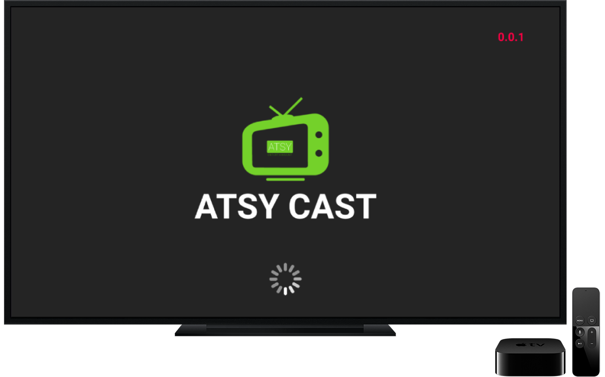

# ATSY Cast

ဤ အက်ပီကေးရှင်းသည် [Android Tv Development](https://developer.android.com/jetpack/androidx/releases/leanback) အတွက် စမ်းသပ်ခြင်းဖြစ်ပါသည်။ [Android Leanback Component](https://developer.android.com/reference/androidx/leanback/app/package-summary) များကို အသုံးပြုပြီး Remote control များနှင့် Customized UI အတွက် စမ်းသပ်ခြင်းဖြစ်ပါသည်။

Application ထဲတွင် အသုံးပြုထားသည့် [API](https://en.wikipedia.org/wiki/API) များသည် သက်ဆိုင်ရာ မူရင်း APP များမှ လာခြင်းဖြစ်ပါသည်။ သို့သော် ယခု Repo တွင် ထို API များတွေ့ရမည်မဟုတ်ပါ။ Application အတွက် Update စစ်ဆေးသည့် [API](https://en.wikipedia.org/wiki/API) သည် [Google Script](https://www.google.com/script/start/) ကို အသုံးပြုထားပါသည်။

Demo Video
----------
  
    
Demo App
--------
  

Screenshot
----------
  

  

  

  

  

  

  

  

  

  

  

  

  

  

License
--------

    Copyright 2021 kyawhtut-cu
    
    Licensed under the Apache License, Version 2.0 (the "License");
    you may not use this file except in compliance with the License.
    You may obtain a copy of the License at
    
     http://www.apache.org/licenses/LICENSE-2.0
    
    Unless required by applicable law or agreed to in writing, software
    distributed under the License is distributed on an "AS IS" BASIS,
    WITHOUT WARRANTIES OR CONDITIONS OF ANY KIND, either express or implied.
    See the License for the specific language governing permissions and
    limitations under the License.
